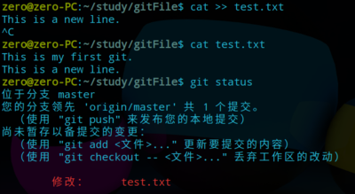

想必每个开发者对Git并不陌生，先来看看官方对于Git的定义：

> Git是一个免费和开源的分布式版本控制系统，旨在快速和有效率地处理从大到小的项目。

#### 安装 Git 和查看 Git 版本

- 安装（仅说明在 *Linux* 系统下的安装，若您是windows系统，直接官网下载安装就行~）

```
sudo apt install git
```


由于我之前已经安装过了，所以这里升级等都是 *0*。

- 查看是否安装成功

```
git
```


输入git命令后，出现一系列关于Git的参数和命令等，说明安装成功了。

- 查看 *Git* 版本

```
git --version
```


#### 创建 Git 仓库

所谓 *Git* 仓库（*repository*），也叫版本库。简单理解，就是可以被 *Git* 管理（修改，删除等）的目录。

- 新建本地目录，并切换到新目录

```
mkdir gitFile
cd gitFile
```


- 将本地目录初始化为 *Git* 仓库

```
git init
```


- 查看 *Git* 仓库的目录

```
ls -al
```


您会发现，这里多了一个 *.git* 的目录，作用是 *Git* 来跟踪管理 *Git* 仓库的；注意，如果输入的命令是 *ls* 是不会看到 *.git*，因为这个目录默认是隐藏的。

#### 将文件放到Git仓库（一定要在 *git init* 的目录／子目录下）

- 新建 *test.txt* 文件并输入内容

```
cat > test.txt
```


- 将 *test.txt* 文件上传到Git仓库

```
git add test.txt 
```

- 告知 *Git* 仓库提交了新文件，并添加标注信息

```
git commit -m "My first git."
```

*-m* 后面是 *commit* 信息。
很简单吧～只需要两步，就可以将文件上传到Git仓库。

- 查看 *Git* 仓库的当前状态

```
git status
```


倘若修改了文件，但没有提交，结果是这样的：



提交后的结果是这样的：


- 查看文件修改内容
  如果修改了文件，但还没提交，可以对比文件前后的修改内容。

```
git diff test.txt
```


可知，文件 *test.txt* 添加了新的一行 *This is the third line.*

#### 创建GitHub账号

如果没有 *GitHub* 账号，得先到[GitHub](https://github.com/)官网注册账号。注册登录为常规操作，不多说。

#### SSH设置

由于Git和GitHub之间是通过SSH加密传输的，所以需要进行SSH设置。

- 创建SSH Key（用户主目录）

```
ssh-keygen -t rsa -C "你的邮箱"
```

接下来回车默认就好了。

- 在用户主目录下找到 *.ssh* 目录

```
ls -al | find -name "*.ssh"
```


- 发现存在 *.ssh* 目录，切换到 *.ssh* 目录，发现文件中秘钥有 *id_rsa*（私钥）和 *id_rsa.pub*（公钥），其中是 *id_rsa.pub* 是我们所需要的

  

- 打开 *ip_rsa.pub* ，并复制

```
cat ip_rsa.pub
```

#### 在 *GitHub* 中添加 *SSH Key*

- Settings->SSH and GRG keys->new SSH key

  

  

  

  

- 创建成功后，跳转页面中你会看到你新建的ssh key

  

#### 创建 *GitHub* 仓库

- 登录GitHub账号后，创建新的仓库，仓库名称看自己需要命名，其他默认就好了。我这里为了测试，就取为**test**

  

  

- GitHub仓库创建成功后，会有SSH和HTTPS地址

  

#### *Git* 连接 *GitHub*，并推送本地文件到远程仓库

- 在本地仓库的目录 *gitFile* 下运行命令

```
git remote add origin 仓库的SSH地址
```


注意，这里的 *origin* 是远程仓库的名字（*Git*的默认叫法）

- 将本地仓库 *Git* 的文件推送到远程仓库 *GitHub*

```
git push -u origin master
```

不出意外，在GitHub的 *test* 仓库中会看到我们传送的文件


#### 从 *GitHub* 中克隆文件到本地

- 在 *GitHub* 中创建文件，并且复制*SSH* 地址

  

  

  

- 输入以下克隆命令

```
git clone SSH地址
```

你会发现，*GitHub* 中的目录包括你刚才新建的文件都存在本地目录中了。