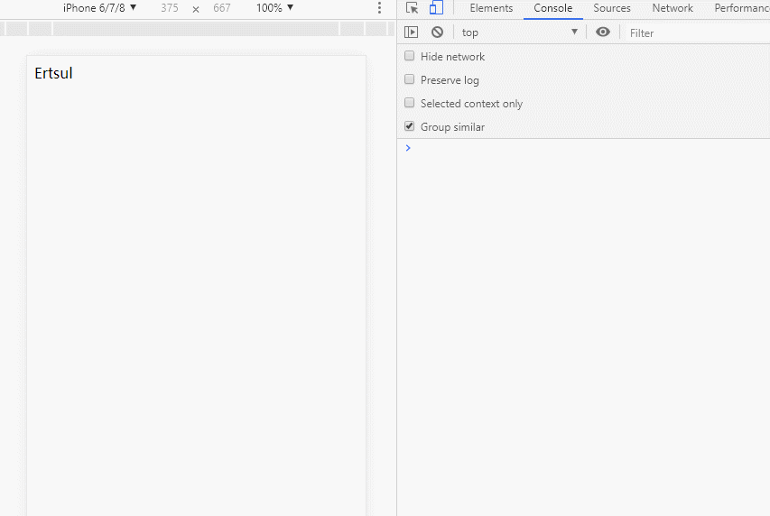
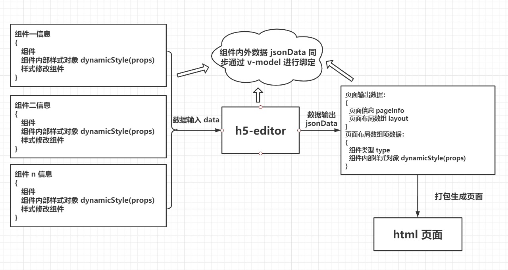

做一个更加通用的可视化搭建平台，用户通过 npm 安装 h5-editor (包名)，就可以直接使用了。

可以使用的功能有：

- 拖拽组件、删除组件；
- 修改页面基本信息，如：页面标题、页面背景色等；
- 修改组件样式，如：组件大小、颜色等；
- 可以使用基础组件（组件内提供）；
- 可以使用自定义组件（用户自己实现的组件）；
- 打包生成静态化页面。

应用场景：面对不同业务所需的组件不同，因此抽离并且封装内部数据流通，封装基础组件。

最终页面效果如下：



## 页面布局


## 数据流转

主要数据流转如下图：



上图就是数据流转的使用图：通过将基础组件信息传入 h5-editor，然后输出一份 json 数据，然后通过这份 json 数据打包生成 html 页面。

组件最后的使用方式为：

```vue
<h5-editor v-model="jsonData" :data="data"></h5-editor>
```

## 数据格式及流转

### 外部传入 h5-editor 组件信息 

外部传入基本数据信息 data 格式如下：

```json
[
    {
        component, // 渲染组件
        styleComponent, // 渲染组件对应修改样式的组件
        dynamicStyle, // 组件样式 props
    },
    {
 		// ...       
    }
]
```

- `component`：渲染组件，即拖拽添加到页面、最后显示到实际页面上的组件；
- `styleComponent`：渲染组件对应的样式修改组件。即在中间预览区域点击了一个组件后，右边区域显示对应的样式修改组件。
- `dynamicStyle`：该属性是传入到组件内部的 props 对象。

### h5-editor 输出数据格式

h5-editor 调用者和 h5-editor 组件通过 v-model 共享一份 jsonData 数据。有两个作用：

- 调用者实时拿到 jsonData 数据；
- 可用于草稿 jsonData 数据的传入初始化 h5-editor 组件信息。

jsonData 数据格式如下：

```json
{
    // 基本配置信息
    pageInfo: {
        title: '', // 页面标题
        description: '', // 页面描述
        backgroundColor: '', // 页面背景色
        // ...
    },
    // 页面布局信息
    layout: [
    	{
    		type: '', // 组件类型，对用 component.name
    		dynamicStyle: { // 页面样式信息 
    			// ...
			}
		}
    ]
}
```

### 数据流转过程

渲染组件 component 和 样式修改组件 styleComponent 都包含这个 props 对象，这样一旦样式修改组件 styleComponent 修改了样式，就通过向父级组件派发样式修改事件 changeStyle（通过 `this.$emit('changeStyle', newDynamicStyleObj)`派发），这样父级组件 h5-editor 就可以接收到样式修改事件和新的样式值，然后将新的样式值注入到渲染组件 component 的 dynamicStyle props 中，最后将页面样式进行更新。


总结：h5-editor 在渲染组件 component 和样式修改组件 styleComponent 之间扮演的角色只是数据转发的作用。