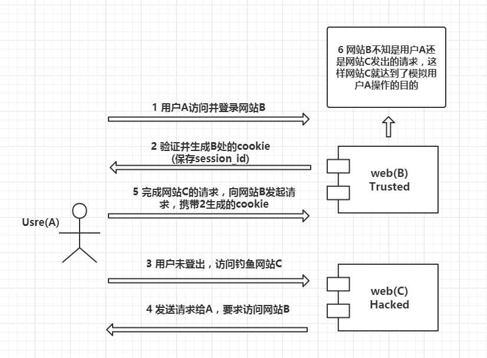

## CSRF : Cross Site Request Forgery

**CSRF** 跨站请求伪造。
是一种劫持受信任用户向服务器发送非预期请求的攻击方式。简而言之：用户在登录的情况下访问了钓鱼网站，钓鱼网站通过用户向其他网站发送请求，这样就达到了模拟用户的目的。具体实现如下图：



#### 防御手段

- 验证码实现用户验证。验证码强制用户必须与应用进行交互，才能完成最终的请求。
- 通过 referer 实现用户验证。根据 **HTTP** 协议，在 **HTTP** 头中有一个字段叫 **Referer**，它记录了该 **HTTP** 请求的 **来源地址**。通过 **Referer Check**，可以检查请求是否来自合法的"源"。
- 通过 token 实现用户验证。
- 尽量不要在页面的链接中暴露用户隐私信息。
- 对于用户修改删除等操作最好都使用 post 操作。
- 避免全站通用的 cookie，严格设置 cookie 的域。

## XSS : Cross Site Script

**XSS** 跨站脚本攻击。
攻击者向用户的网站嵌入的 js 脚本代码，当用户访问该网站的时候，该 js 脚本代码就会被执行，从而达到攻击用户的目的。

#### 反射型 XSS 攻击

又称非持久性跨站脚本攻击。发出请求时，XSS 代码出现在 **URL** 中，作为输入提交到服务器端，服务器端解析后响应，XSS 随响应内容一起返回给浏览器，最后浏览器解析执行 XSS 代码。漏洞产生的原因是攻击者注入的数据反映在响应中。一个典型的非持久性 XSS 包含一个带 XSS 攻击向量的链接(即每次攻击需要用户的点击)。
比如：

```
http://www.test.com/message.php?send=<script>alert(‘foolish!’)</script>！
```

#### 存储型 XSS 攻击

XSS 提交的代码会存储在服务器端（数据库，内存，文件系统等），下次请求目标页面时不用再提交 XSS 代码。这种攻击方式的稳定性很好。
比如：

> 攻击者在 value 填写`<script>alert(‘foolish!’)</script>`【或者 html 其他标签（破坏样式。。。）、一段攻击型代码】；将数据存储到数据库中；其他用户取出数据显示的时候，将会执行这些攻击性代码。

#### 具体方式

- 攻击者向服务器注入 js 代码。
- 诱导用户访问受到攻击的网站。
- 用户访问受到攻击的网站，执行注入的 js 代码。

#### XSS 防御方式

- HttpOnly
- 输入检查
- 输出检查

参考链接：

- https://www.cnblogs.com/shytong/p/5308667.html
- https://github.com/dwqs/blog/issues/68
- https://www.cnblogs.com/phpstudy2015-6/p/6767032.html#_label3
